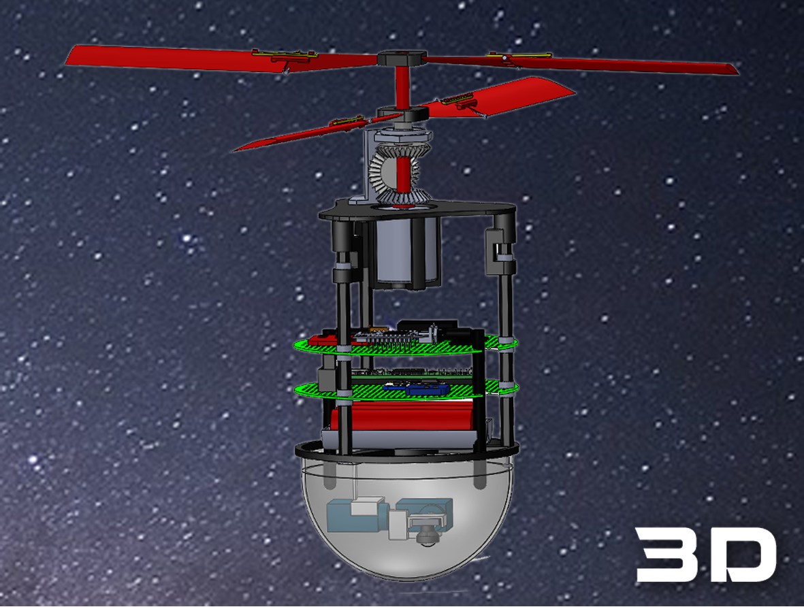
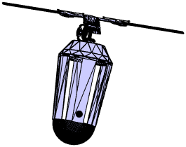
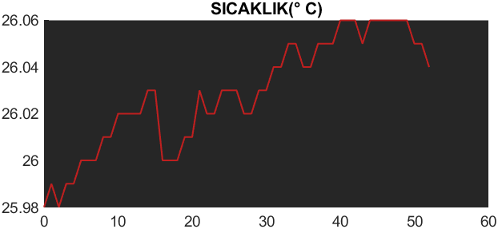
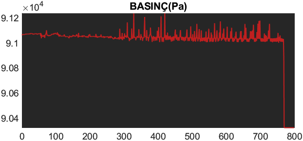
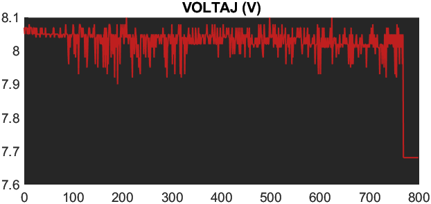
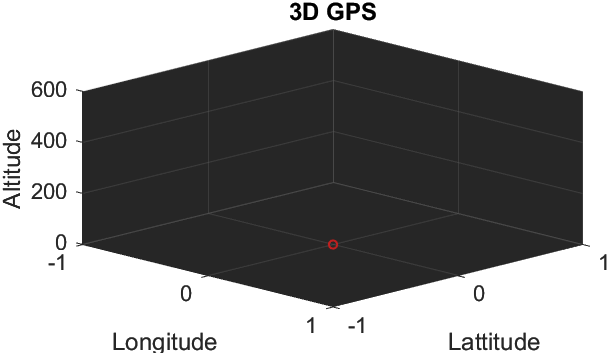

## GroundStation

#### Gazi Uzay
>

 

> Gazi Uzay which founded in September 2019     finished 18th among 149 teams in the 2020 Teknofest Model Satellite Competition.

#### General Information About The Competition :

TÜRKSAT Model Satellite Competition is a design-build-flight competition. The T-MUY provides teams with an opportunity to experience process from design to beginning of active mission of an aerospace system. The T-MUY competition is planned to reflect an aerospace project on a small scale and includes all aspects of an aerospace project, from design to production and post-mission review. The competition is designed to reflect various aspects of real missions such as addressing telemetry and communication requirements, provide autonomous structure and developing an interdisciplinary working system.

T-MUY aims to provide undergraduate and graduate students with the opportunity to transfer knowledge from theory to practice and to acquiring the ability to work interdisciplinary. Additionally, It is aimed that the students will have the opportunity to share their experiences with other university teams and to communicate with the institution, companies, experts and engineers operating in the sector.

- **Team Advisor**

    - Prof.Dr. Ahmet Bingül

- **Team Members**

    - Enes Alp

    - Tayfur Çınar

    - Ozan Kaçar

    - Ahmet Uzun

    - Emre Can Sönmez

---

[GAZIMODELUYDU_V1.0.m](GAZIMODELUYDU_V1.0.m) just added for showing the code.

Original file is [GaziGroundStation.mlapp](GaziGroundStation.mlapp) but you can't see the code on Githup so I use [GAZIMODELUYDU_V1.0.m](GAZIMODELUYDU_V1.0.m) file for showing code.

> When you install the code, you can't run the software because you must fix the images directory files.

   

> There is a 3D model satallite  behind the 3D png image.

   

   

| |  |
|-----|-----|
|  | 
